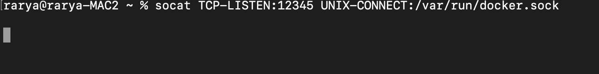
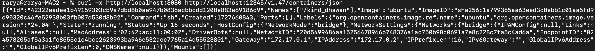
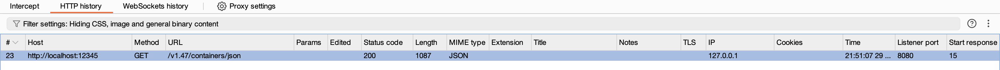
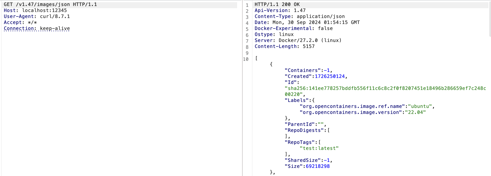

## Intercepting Docker cli UNIX socket requests through Burp

Docker is now a household name in container technology, and for good reason. The Docker CLI makes managing containers and everything related to them incredibly simple and efficient, making it a go-to tool in my workflow.

Docker CLI uses REST API to connect to Docker Daemon (dockerd), which by default listens for requests on the UNIX socket, ideally located at `/var/run/docker.sock`, to only allow local connections by the root user. We do have another option to expose a TCP port and proxy curl command through it.

We need to have a bridge between the Unix socket and a local TCP port, which will act as a gate to the unix socket.

One of the best tools to create this relay will be ``socat``. According to the manual - 
_Socat is a command line based utility that establishes two bidirectional byte streams and transfers data between them._  We will use socat to create a bridge between a random TCP port and the unix socket. 

### Installation
It is easily available on brew and can be easily installed using the command - `` brew install socat``

### Pre-requisites
Before executing, we need to setup Burp Proxy. No special configuration changes are needed and simple following steps from this documentation should work - https://portswigger.net/burp/documentation/desktop/external-browser-config.

Burp Suite for my system is configured on the port 8080 - HTTP requests sent to that port, will be available in Burp. Simply putting burp intercept to off and seeing the requests in Proxy history will work.

After sucessfully setting up Burp, to get the request to docker Daemon and response back, we need to have the Docker running in our system. Easiest way to verify if daemon is running or not by simpy executing the `docker ps` command. If you see a connection error, that indicates thet daemon is not running and needs to be initialized. 

### Process

socat seems to be a pretty powerful tool and just listing the help command, gives list of available flags/commands, extending more than a page.

To expose the Unix socket over TCP we will use the command:

``socat TCP-LISTEN:12345,fork UNIX-CONNECT:/var/run/docker.sock
``

Note: Observe the _fork_ keyword  in the command. This will ensure that socat do not terminate after we execute a curl request, and stays ALIVE.

1. Imagine the TCP port 12345 as the gateway to the docker socket. Anything send to this port will be forwarded to the socket, where docker daemon is listening. 

2. UNIX-CONNECT - is the location of the docker socket. By default it is located at /var/run/docker.sock and but might vary based on the system. Ref- https://docs.docker.com/reference/cli/dockerd/

Executing the command, would not show any output in the console.

In another terminal, we will send the curl request. To correctly formulate the request we need to keep two things in mind:
1. The request should be proxied to port where burp is listening i.e. localhost:8080

2. The curl requests should be made to the exposed TCP port from the `socat` command - 12345

Working on the curl request it would simply narrow down to - 

``curl -x http://localhost:8080 http://localhost:12345/v1.47/containers/json``

Observation:
1. `-x` parameter to proxy request to the port 8080
2. Request is sent to the endpoint `/v1.47/containers/json` -  which retrieves details about running containers.

Docker API details can be found at - https://docs.docker.com/reference/api/engine/version/v1.47/

### Burp

Observe the response in the terminal after sending thr curl request:

We get the details of the docker containers running on the system. Now check Burp Proxy history for any requests. You should see a GET request made to the address - localhost:12345 like the below screenshot:

Finally, we got the request in Burp. To have fun with docker daemon calls, send the request to Burp Repeater, and start playing with different methods, and paramteres. By leveraging the API documentaion, you can easily upate the request in Burp and forward it.

This request is querying the images in the local docker registry.

Docker CLI commands in the background send similar API calls to the docker daemon through the Unix socket. Intercepting these requests through Burp gives a clear understanding of how things work, and provides a nice steady interface for security testing.

Thank you for reading the blog!
